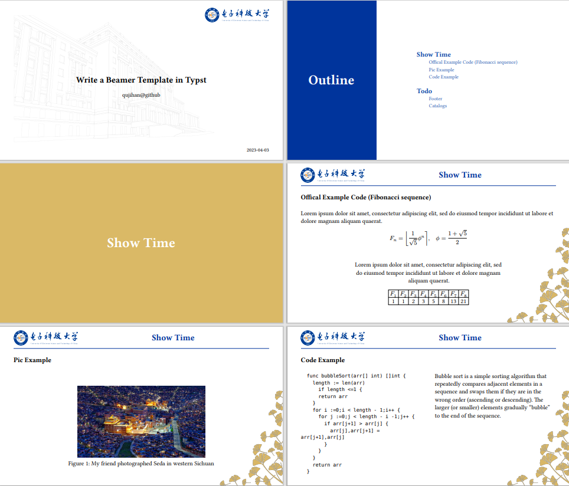
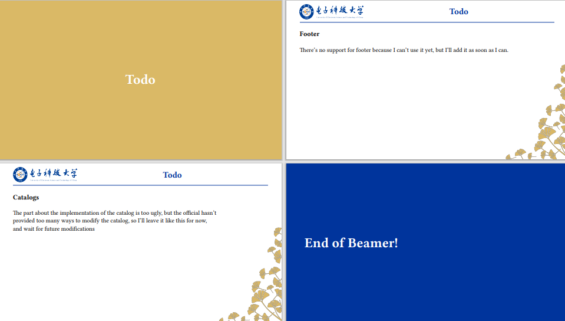

# Beamer in [Typst](https://typst.app/)
[中文](https://github.com/qujihan/typst-beamer/blob/main/readme_zh.md) | [English](github.com/qujihan/typst-beamer)

todo:[Bilibili]()

## What does it look like?



or download [PDF](https://github.com/qujihan/typst-beamer/blob/main/example/example.pdf)

## How to complile example code
**Note:** If you use vscode and Typst LSP, it may report an error, that's normal, wait for the plugin to be updated.
Linux/Macos
```
typst --root . c ./example/exaple.typ
```

Windows
```
typst --root . c .\example\exaple.typ
```

## Quick Start
```
#import "beamer.typ": beamer

#show: beamer.with(
  title: "Write a Beamer Template in Typst",
  author: "qujihan@github",
  date: "2023-07-17",
)

= First

== Second
...

```
` = ` creates a split page, ` == ` creates a new page, and the title at the top of each page is the title of ` = `.


## Thanks
[diapo](https://github.com/lvignoli/diapo) 